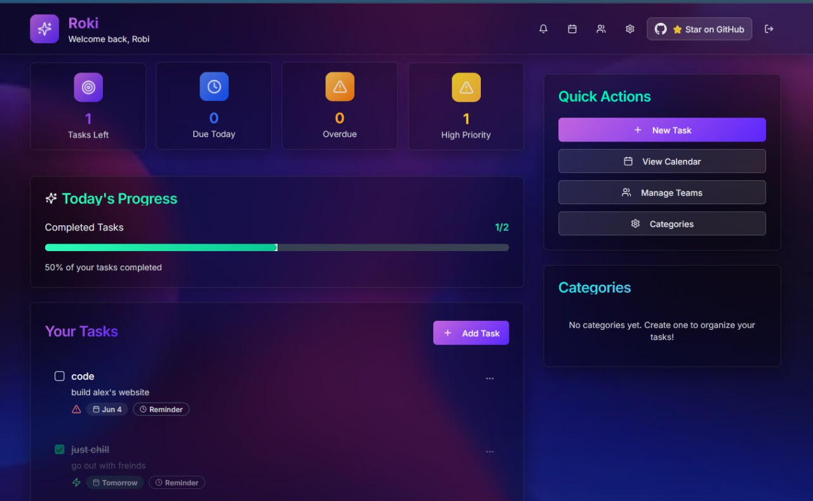

# 🌟 Roki - Smart Todo List with Team Collaboration

**Roki** is a modern, intelligent todo list application built with Next.js, Supabase, and a beautiful fluid gradient design. Created by **Robera**, Roki combines productivity with stunning visuals and powerful collaboration features.

## ✨ Features

### 🎯 **Core Functionality**
- **Smart Task Management** - Create, edit, and organize tasks with priorities
- **Beautiful UI** - Fluid gradient design with glassmorphism effects
- **Real-time Updates** - Instant synchronization across all devices
- **Categories & Organization** - Custom categories with colors and icons
- **Due Dates & Reminders** - Never miss a deadline again

### 👥 **Team Collaboration**
- **Team Creation** - Create and manage teams with invite codes
- **Shared Tasks** - Collaborate on tasks with team members
- **Role Management** - Owner, admin, and member roles
- **Team Invitations** - Easy team joining with invite codes

### 📅 **Advanced Features**
- **Calendar View** - Visualize tasks in a beautiful calendar interface
- **Notification Center** - Stay updated with smart notifications
- **Email Reminders** - Get notified via email for important tasks
- **Progress Tracking** - Monitor your productivity with visual progress bars
- **Mobile Responsive** - Perfect experience on all devices

### 🎨 **Design & UX**
- **Fluid Animations** - Smooth, engaging animations throughout
- **Dark Theme** - Easy on the eyes with beautiful gradients
- **Glassmorphism** - Modern glass-like UI components
- **Responsive Design** - Optimized for desktop, tablet, and mobile

## 🚀 Getting Started

### Prerequisites
- Node.js 18+ 
- npm or yarn
- Supabase account

### Installation

1. **Clone the repository**
   \`\`\`bash
   git clone https://github.com/robikas19/roki-todo-app.git
   cd roki-todo-app
   \`\`\`

2. **Install dependencies**
   \`\`\`bash
   npm install
   # or
   yarn install
   \`\`\`

3. **Set up environment variables**
   
   Create a \`.env.local\` file in the root directory:
   \`\`\`env
   NEXT_PUBLIC_SUPABASE_URL=your_supabase_url
   NEXT_PUBLIC_SUPABASE_ANON_KEY=your_supabase_anon_key
   SUPABASE_SERVICE_ROLE_KEY=your_supabase_service_role_key
   NEXT_PUBLIC_SITE_URL=http://localhost:3000
   \`\`\`

4. **Set up Supabase database**
   
   Run the SQL scripts in your Supabase SQL editor to create the necessary tables:
   - Users table with RLS policies
   - Categories, todos, and notifications tables
   - Team collaboration tables
   - Email notifications table

5. **Run the development server**
   \`\`\`bash
   npm run dev
   # or
   yarn dev
   \`\`\`

6. **Open your browser**
   
   Navigate to [http://localhost:3000](http://localhost:3000)

## 🗄️ Database Schema

### Core Tables
- **users** - User authentication and profiles
- **categories** - Task categories with colors and icons
- **todos** - Main tasks table with priorities and due dates
- **notifications** - System notifications and reminders

### Team Collaboration
- **teams** - Team information and invite codes
- **team_members** - Team membership with roles
- **shared_todos** - Tasks shared within teams
- **email_notifications** - Email reminder system

## 🎨 Design System

### Color Palette
- **Primary Purple**: \`#c165dd\` to \`#5c27fe\`
- **Teal Accent**: \`#2afeb7\` to \`#08c792\`
- **Blue Gradient**: \`#5581f1\` to \`#1153fc\`
- **Orange Highlight**: \`#ffcb52\` to \`#ff7b02\`
- **Pink Accent**: \`#facd68\` to \`#fc76b3\`

### Typography
- **Font**: Inter (Google Fonts)
- **Headings**: Gradient text effects
- **Body**: Clean, readable typography

## 🛠️ Tech Stack

### Frontend
- **Next.js 14** - React framework with App Router
- **TypeScript** - Type-safe development
- **Tailwind CSS** - Utility-first CSS framework
- **Shadcn/ui** - Beautiful, accessible UI components
- **Lucide React** - Modern icon library

### Backend & Database
- **Supabase** - Backend-as-a-Service
- **PostgreSQL** - Robust relational database
- **Row Level Security** - Secure data access
- **Real-time subscriptions** - Live updates

### Deployment
- **Vercel** - Seamless deployment and hosting
- **Environment Variables** - Secure configuration management

## 📱 Features in Detail

### Task Management
- Create tasks with titles, descriptions, and priorities
- Set due dates and reminder notifications
- Organize with custom categories
- Mark tasks as complete with satisfying animations

### Team Collaboration
- Create teams with unique invite codes
- Invite members via email or invite codes
- Share tasks with team members
- Manage team roles and permissions

### Notifications
- In-app notification center
- Email reminders for due tasks
- Real-time updates for team activities
- Customizable notification preferences

### Calendar Integration
- Monthly calendar view of all tasks
- Visual indicators for task density
- Quick task creation from calendar
- Due date visualization

## 🚀 Deployment

### Deploy to Vercel

1. **Connect your repository** to Vercel
2. **Set environment variables** in Vercel dashboard
3. **Deploy** - Vercel will automatically build and deploy

### Environment Variables for Production
\`\`\`env
NEXT_PUBLIC_SUPABASE_URL=your_production_supabase_url
NEXT_PUBLIC_SUPABASE_ANON_KEY=your_production_anon_key
SUPABASE_SERVICE_ROLE_KEY=your_production_service_role_key
NEXT_PUBLIC_SITE_URL=https://your-app-domain.vercel.app
\`\`\`

## 🤝 Contributing

Contributions are welcome! Please feel free to submit a Pull Request.

1. Fork the project
2. Create your feature branch (\`git checkout -b feature/AmazingFeature\`)
3. Commit your changes (\`git commit -m 'Add some AmazingFeature'\`)
4. Push to the branch (\`git push origin feature/AmazingFeature\`)
5. Open a Pull Request

## 📄 License

This project is licensed under the MIT License - see the [LICENSE](LICENSE) file for details.

## 👨‍💻 Creator

**Robera Kassaye** - Creator and Lead Developer

- GitHub: [@robikas19](https://github.com/robikas19)
- Email: [your-email@example.com]

## 🙏 Acknowledgments

- **Supabase** - For the amazing backend-as-a-service platform
- **Vercel** - For seamless deployment and hosting
- **Shadcn/ui** - For the beautiful component library
- **Tailwind CSS** - For the utility-first CSS framework

## 📸 Screenshots

### Dashboard

### Calendar View

---

⭐ **Star this repository** if you found it helpful!

Built with ❤️ by Robera Kassaye
\`\`\`

Now let's update the authentication context to handle the email confirmation better:
